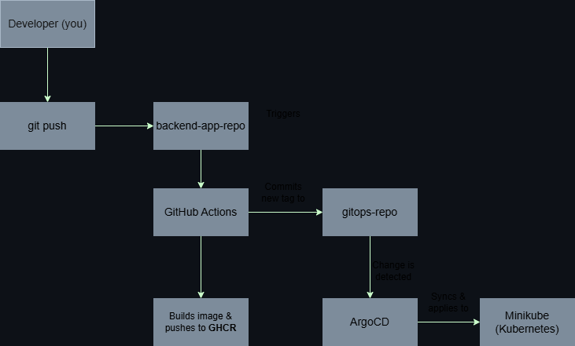

# Portfolio Project: Fully Automated CI/CD GitOps Pipeline

This project demonstrates a complete, end-to-end CI/CD lifecycle for a web application using modern DevOps tools and the GitOps methodology.

The entire system is designed to take a code change from a developer's commit and automatically deploy it to a Kubernetes cluster with zero manual intervention.

## Tech Stack
* **Containerization:** Podman
* **Setup Automation:** Ansible
* **CI (Continuous Integration):** GitHub Actions
* **CD (Continuous Delivery):** ArgoCD (GitOps)
* **Orchestration:** Kubernetes (Minikube)
* **Image Registry:** GitHub Container Registry (GHCR)

## Project Architecture

This project uses a GitOps architecture with a clear separation of concerns, split into two repositories:

1.  **[backend-app-repo](https://github.com/aditudor30/backend-app-repo):** The Application Source Code. This repo holds the Java application and its **CI** (Continuous Integration) pipeline.
2.  **[gitops-repo](https://github.com/aditudor30/gitops-repo):** The "Single Source of Truth." This repo holds the Kubernetes manifests and is monitored by **ArgoCD** for **CD** (Continuous Delivery).

### Workflow Diagram

## The Automated Workflow (How it Works)

1.  **Commit (CI):** A developer pushes a code change to the `main` branch of `backend-app-repo`.
2.  **Build & Push:** **GitHub Actions** is automatically triggered. It builds a new Podman image, tags it with the unique commit SHA (e.g., `...:a1b2c3d`), and pushes it to the private **GitHub Container Registry (GHCR)**.
3.  **Update Config (GitOps):** The *same* GitHub Actions workflow then checks out the `gitops-repo`, updates the `backend.yaml` manifest file with the new image tag, and pushes this change.
4.  **Deploy (CD):** **ArgoCD** is constantly monitoring `gitops-repo`. It immediately detects the new commit, sees the configuration drift, and auto-syncs the change to the **Minikube** cluster.
5.  **Result:** Kubernetes performs a zero-downtime **rolling update**, terminating the old application pod and starting a new one with the updated image.

**You can see the automation in action by checking this repo's [commit history](https://github.com/aditudor30/gitops-repo/commits/main), where you will find commits made by "GitHub Actions".**
